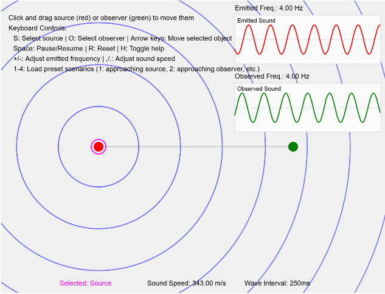

# Doppler Effect Simulation

An interactive physics simulation that demonstrates the Doppler effect with real-time visualization of sound waves, frequencies, and waveforms.

## Overview

This simulation allows users to explore the Doppler effect by manipulating a sound source and an observer in a 2D environment. The Doppler effect is the change in frequency of a wave in relation to an observer who is moving relative to the wave source. It is commonly experienced when a vehicle sounding a siren approaches, passes, and recedes from an observer - the received frequency is higher during approach, identical at the instant of passing, and lower during recession.

Try it here:  https://veillette.github.io/dopplerEffect/ 

## Features

- **Interactive Sound Source and Observer**: Drag either object with your mouse or use keyboard controls
- **Real-time Wave Visualization**: See sound waves propagate through the environment
- **Frequency Analysis**: Real-time display of emitted and observed frequencies
- **Blueshift/Redshift Indicators**: Visual and textual feedback on frequency shifts
- **Preset Scenarios**: Quick setup of common Doppler effect demonstrations
- **Adjustable Parameters**: Modify sound speed and emitted frequency
- **Physically Accurate**: Based on the actual physics equations for the Doppler effect

## Controls

### Mouse Controls
- Click and drag the red circle (source) to move the sound source
- Click and drag the green circle (observer) to move the observer

### Keyboard Controls
- **S**: Select source for keyboard control
- **O**: Select observer for keyboard control
- **Arrow keys**: Move the selected object
- **Space**: Pause/Resume the simulation
- **R**: Reset the simulation
- **H**: Toggle help text
- **+/-**: Increase/decrease the emitted frequency
- **,/.**: Decrease/increase the speed of sound

### Preset Scenarios
- **1**: Source moving toward stationary observer (demonstrates blueshift)
- **2**: Observer moving toward stationary source (demonstrates blueshift)
- **3**: Source and observer moving away from each other (demonstrates redshift)
- **4**: Source and observer moving perpendicular to each other (demonstrates varying shifts)

## Implementation Details

The simulation is built with p5.js and features:

- Frame-rate independent physics calculations
- Smooth phase transitions for realistic waveform visualization
- Color-coded visual feedback
- Real-time waveform graphs
- Velocity vector visualization
- Multiple visualization layers

## Getting Started

1. Clone this repository or download the source files
2. Open `index.html` in a web browser
3. Click and drag the red (source) or green (observer) circles
4. Observe the wave patterns and frequency changes

## Technical Notes

- All physical quantities are calculated in SI units (meters, seconds)
- Conversions between display units (pixels) and physical units (meters) are handled automatically
- The simulation uses a real-time scaling factor to slow down wave propagation for better visualization

## License

[GPL License](LICENSE)
